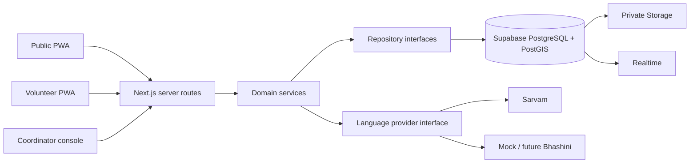

# Architecture

The domain owns status transitions, triage governance and assignment rules. Framework, database and language integrations sit at boundaries so Supabase, Sarvam and Vercel can be replaced. Browser code receives no provider or service-role credentials. Original content and every derived transcript/translation are separate immutable facts; corrections do not overwrite originals.

Public tracking is a deliberately narrow projection. Sensitive exact locations, contact data, medical details, recordings and internal notes never enter it.
